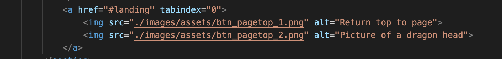

# Procesverslag
Markdown is een simpele manier om HTML te schrijven.  
Markdown cheat cheet: [Hulp bij het schrijven van Markdown](https://github.com/adam-p/markdown-here/wiki/Markdown-Cheatsheet).

Nb. De standaardstructuur en de spartaanse opmaak van de README.md zijn helemaal prima. Het gaat om de inhoud van je procesverslag. Besteedt de tijd voor pracht en praal aan je website.

Nb. Door *open* toe te voegen aan een *details* element kun je deze standaard open zetten. Fijn om dat steeds voor de relevante stuk(ken) te doen.

## Jij

uitwerken voor kick-off werkgroep

### Auteur:
Bram Tersteeg.

#### Je startniveau:
Rood, ken wel een beetje maar ben nog niet mega goed.

#### Je focus:
Surface plane en responsive
 

## Je website

uitwerken voor kick-off werkgroep

### Je opdracht:
https://www.orsm.jp/#top

#### Screenshot(s) van de eerste pagina (small screen): 
Landing section

#### Screenshot(s) van de tweede pagina (small screen):
Begin animatie

News section

 

## Breakdownschets (week 1)

uitwerken na afloop 2e werkgroep

### de hele pagina: 

### dynamisch deel 1 (scrollanimatie): 

### dynamisch deel 2 (hamburgermenu mobiel): 

## Voortgang 1 (week 2)

uitwerken voor 1e voortgang

### Stand van zaken
Ik heb een start gemaakt aan mijn HTML. Ik was soms nog wel even aan het twijfelen of ik dingen soms semantischer neer kon zetten, maar verder ging het goed. Ik heb gekeken naar het maken van een hamburgermenu met javascript om mijn kennis weer even op te frissen, en ik heb gekeken naar de Intersection Observer.  

### Agenda voor meeting
samen met je groepje opstellen

| Bram     | Xiao Nan         | Kevin    | Tijn        |
| ---      | ---              | ---      | ---         |
|  | aria-label | figure/figcaption |  |
|          | feedback op haar html | achtergrondimg |   |
|          |                  |          |             |
| ...      | ...              | ...      | ...         |

### Verslag van meeting
hier na afloop snel de uitkomsten van de meeting vastleggen

- Door het kijken naar Xiao Nan haar HTML zijn we allemaal iets meer te weten gekomen over semantische HTML.
- Geleerd hoe we een aria-label moeten gebruiken.
- .Visually-hidden class gebruiken als je een heading element in een element niet wil gebruiken maar er wel in stopt voor semantiek. https://www.a11yproject.com/posts/2013-01-11-how-to-hide-content/ 
- Opgefrist wanneer je nou een button of a element gebruikt.

## Voortgang 2 (week 3)

uitwerken voor 2e voortgang

### Stand van zaken
Ik ben verder gegaan aan mijn HTML en heb hierbij wat content toegevoegd aan mijn website. De sections staan en zijn nu scrollbaar met de intersection observer (hoewel deze het nu even niet goed doet.) Ik ben van plan alle content eerst in de website te zetten en daarna aan de animaties te beginnen.

### Agenda voor meeting
samen met je groepje opstellen

| Bram     | Xiao Nan          | Kevin    | Tijn       |
| ---            | ---                | ---          | ---              |
| toevoegen van een slider | witruimte tussen afbeelding en section weghalen | hamburgermenu |    |
|                |                    |              |                  |
| ...            | ...                | ...          | ...              |

Bonus tip van Yunus: Schrijf zo helder mogelijke css, toepassen van bepaalde structuur kan helpen.

### Verslag van meeting
hier na afloop snel de uitkomsten van de meeting vastleggen

- Door de link naar Sanne zijn voorbeelden over sliders, wist ik beter hoe ik mijn eigen sliders aan moest pakken.
- Ik ben iets meer te weten gekomen over debuggen, omdat Xiao Nan een probleem had waar de studentassistenten ook niet zo snel een antwoord op wisten.

## Toegankelijkheidstest (week 4)

uitwerken na test in 8e voortgang

### Bevindingen
1. Button voor het hamburgermenu word overgeslagen aan het begin.
2. Als het menu openstaat is andere content op de pagina nog gewoon toegankelijk wat niet hoort.
3. Met de screenreader was er een goede scheiding tussen Engelse en Japanese content en veranderde hij goed van stem. Alleen konder sommige aria-labels nog duidelijker.
4. Met de wazige bril was sommige tekst soms slecht leesbaar, dit gelde vooral voor de content van de slider.

#### Overgeslagen hamburgericoon (Toetsenbord)
Bij het tabben door de website werd op mobiel elke keer het hamburgermenu overgeslagen en ging je meteen naar de live section toe. 

Ik had hiernaar gekeken en wat het had opgelost was om de tabIndex van 0 naar 1 te veranderen.

#### Alle content toegankelijk als menu openstaat (Toetsenbord)
Bij het tabben kwam ik er achter dat als het menu openstaat hij gewoon naar de volgende section toe tabbed als je bij het laatste menu item bent.

Michiel en ik hadden dit nagevraagd aan Sanne en hij gaf ons een paar links waarmee we dit probleem aan konden pakken.

1. https://developer.mozilla.org/en-US/docs/Web/API/Document/keydown_event
2. https://developer.mozilla.org/en-US/docs/Web/CSS/:focus-within
3. https://keycode.info/

Ik heb besloten hiernaar te gaan kijken als ik tijd over heb.

#### Zowel Japans als Engels (screenreader)
Voor mijn website was het een uitdaging om zowel Japans en Engels leesbaar te kunnen maken met de screenreader. Gelukkig ging dit goed omdat ik al vrij vroeg op Japanse elementen de lang had verandert naar "ja". Het enige wat soms nog een beetje moeizaam ging was dat ik een element slecht had uitgelegd of dat twee elementen die gewrapped waren niet goed voor werder gelezen.

Na een gesprekje te hebben gehad met Sanne vertelde hij over aria-hidden="true". Ik heb dit opgezocht en toen zelf proberen te gebruiken.
https://developer.mozilla.org/en-US/docs/Web/Accessibility/ARIA/ARIA_Techniques/Using_the_aria-hidden_attribute

#### Sommige content onleesbaar voor slechtzienden
Door een wazige bril op te hebben gezet kwam ik erachter dat kleine dingen in de slider bijvoorbeeld slecht leesbaar waren. Daarom heb ik besloten de mobiele versie van de website ook mee te maken. De titels waren wel groot genoeg om te lezen met de bril op. Ik zou dit op kunnen lossen door op mobiel specifiek, de kleine content uit de slider bijvoorbeeld grotere blokken te kunnen geven.

## Voortgang 3 (week 4)

uitwerken voor 3e voortgang

### Stand van zaken

Ik heb een tijd zitten twijfelen om mobiel anders te maken dan desktop. In de echte site is er een aparte versie voor mobiel en desktop, hij stemt dit automatisch af op het device dat gebruikt word. Hierom leek mij dit leuk om dit ook te proberen, ik heb hierom nu images toegevoegd die tussen de section geplaatst worden als mobiele banners. Deze banners krijgen op groot scherm een display: none; zodat ze zichzelf verbergen. Ook werken de sliders anders op mobiel omdat ze zo beter leesbaar zijn.

Na het toevoegen van de banners op mobiel kwam hier helaas witruimte onder te zitten die ik niet weg kon krijgen. Na met Yunus gepraat te hebben vonden wij dit artikel:
https://stackhowto.com/how-to-remove-white-space-under-an-image-using-css/

In dit artikel stond dat je een display: block; op de image moest zetten. Dit heb ik ook gedaan en toen ging gelukkig de witruimte weg.

### Agenda voor meeting
samen met je groepje opstellen

| student 1      | student 2          | student 3    | student 4        |
| ---            | ---                | ---          | ---              |
| dit bespreken  | en dit             | en ik dit    | en dan ik dat    |
| en dat ook nog | dit als er tijd is | nog een punt | dit wil ik zeker |
| ...            | ...                | ...          | ...              |

### Verslag van meeting
hier na afloop snel de uitkomsten van de meeting vastleggen

- punt 1
- punt 2
- nog een punt
- ...

## Eindgesprek (week 5)

uitwerken voor eindgesprek

### Stand van zaken
hier dit ging goed & dit was lastig (neem ook screenshots op van delen van je website en code)

### Screenshot(s)

hier screenshot(s) van je eindresultaat

## Bronnenlijst

continu bijhouden terwijl je werkt

Nb. Wees specifiek ('css-tricks' als bron is bijv. niet specifiek genoeg).

1. https://developer.mozilla.org/en-US/docs/Web/API/Intersection_Observer_API
2. https://medium.com/elegant-seagulls/parallax-and-scroll-triggered-animations-with-the-intersection-observer-api-and-gsap3-53b58c80b2fa
3. https://stackhowto.com/how-to-remove-white-space-under-an-image-using-css/
4. https://developer.mozilla.org/en-US/docs/Web/CSS/:focus-within
5. https://developer.mozilla.org/en-US/docs/Web/API/Document/keydown_event
6. https://keycode.info/
7. https://www.sinds1971.nl/fed/bolletjes/index.html

